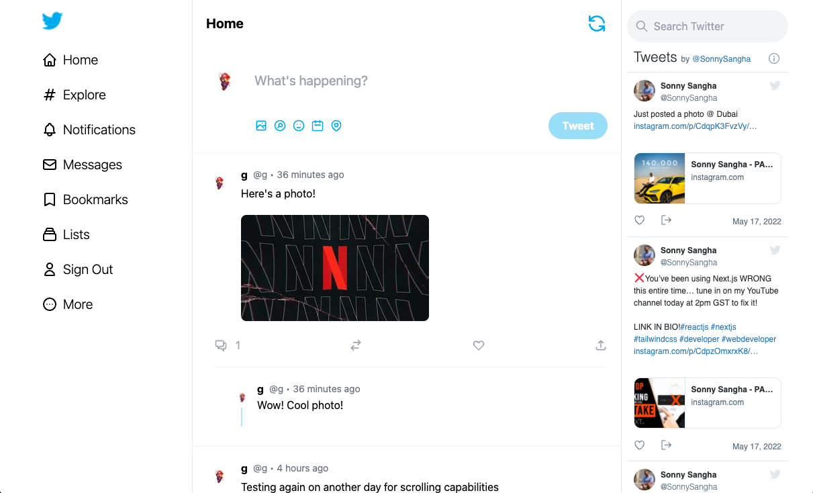
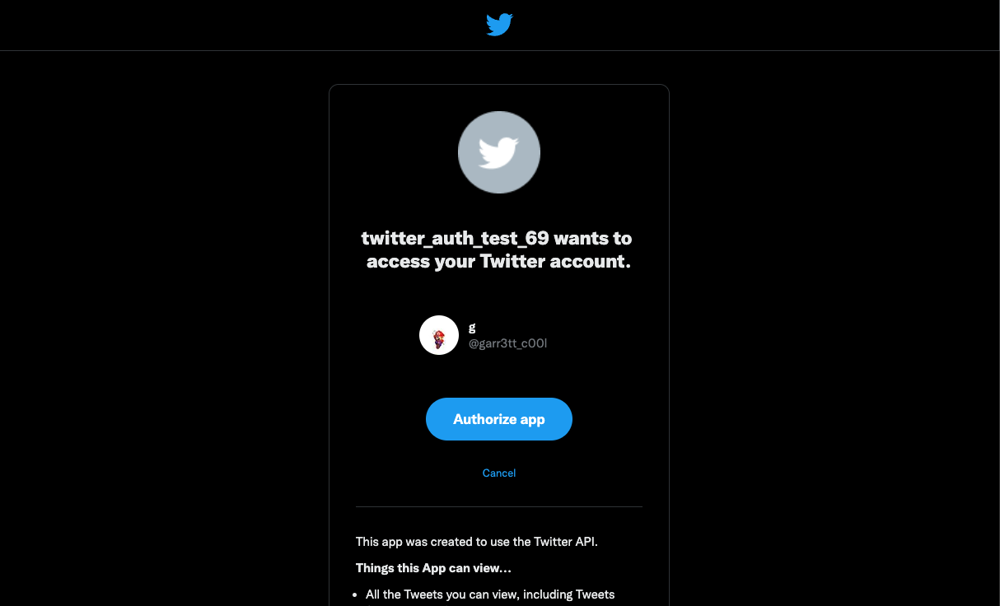

# Twitter Clone

> Working Twitter clone with Tweets and Comments. Based on Sonny Sangha's Twitter Clone tutorial. [Live Demo Here](twitter-clone-smoky-seven.vercel.app)

## Table of Contents

- [General Info](#general-information)
- [Technologies Used](#technologies-used)
- [Features](#features)
- [Screenshots](#screenshots)
- [Project Status](#project-status)
- [Room for Improvement](#room-for-improvement)
- [Acknowledgements](#acknowledgements)

## General Information

- Working Twitter clone with tweets, comments, and a connected CMS through Sanity CMS.
- Users of this demo can sign in using the Sign In button on the navigation bar to the left. It will require them to connect their Twitter account to post, comment, and see full functionality of the clone.
- I wanted to get more exposure with different technologies as I expand my working porfolio and this build had a number of technologies that were interesting to me.
- This was my first interaction, aside from basic video tutorials, with Typescript and it was truly a trial by fire. Strongly typed languages have their pros and I can see that now with this build.
- Working with a backend/CMS like Sanity was interesting as well as they have a developer instance that was helpful to visualize storage and interactions between tweets and comments.

## Technologies Used

- Typescript v4.5.4
- Next v12.1.6
- NextAuth v4.3.4
- Next-Sanity v0.5.2
- React v17.0.2
- Tailwind v3.0.7

## Features

List the ready features here:

- Authentication using NextAuth
- Responsive design using Tailwind CSS
- Fully mapped CMS backend using Sanity CMS

## Screenshots

## Project Status

Project is: _complete_

## Room for Improvement

- Could make the embedded timeline on the right hand side scrollable. It takes up the width of the screen along with the main timeline, but is not nearly as responsive to standard props like other components.
- Could have implemented more options for the NextAuth authentication methods.

## Acknowledgements

- This project was based on Sonny Sangha's Twitter 2.0 tutorial [linked here](https://www.youtube.com/watch?v=rCselwxbUgA&t=134s&ab_channel=SonnySangha)
